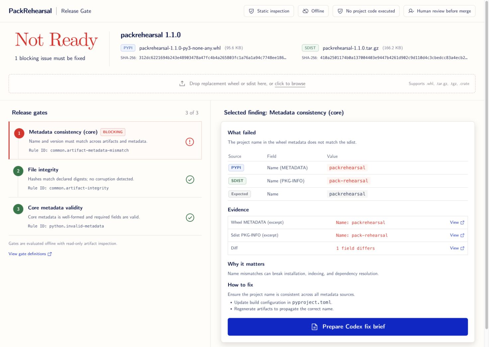

# PackRehearsal Release Gate WebUI

This directory contains the local-first Release Gate frontend for
PackRehearsal. Its visual hierarchy follows the release decision itself:
verdict, artifact identity, gate evidence, remediation, then a bounded Codex
maintenance brief.



## Run locally

```bash
npm ci
npm run dev
```

Open `http://127.0.0.1:5173/`. A production build and the static hosting
contract can be verified with:

```bash
npm run build
npm run test:sites
```

## Current scope

- Computer Modern typography: CMU Serif for the release verdict, CMU Sans
  Serif for interface text, and CMU Typewriter Text for hashes and rule IDs.
- Responsive desktop and mobile release-gate layouts.
- Selectable blocking and passed gates, evidence dialogs, and a deterministic
  Codex maintenance-task preview.
- Local file selection and real in-browser SHA-256 calculation. Files are not
  uploaded and project code is not executed.
- No automatic edit, merge, publish, or release action.

This is an interaction and design preview. Its bundled finding is fixture data;
the PackRehearsal CLI remains the source of truth until report import is wired
into a later release.

The design contract is recorded in [DESIGN.md](DESIGN.md), and visual QA is in
[design-qa.md](design-qa.md).
